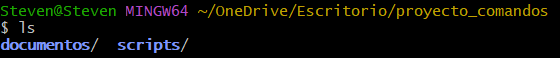
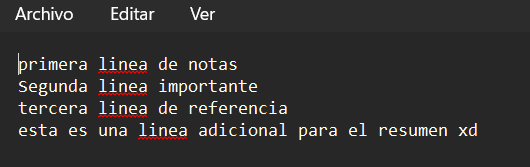
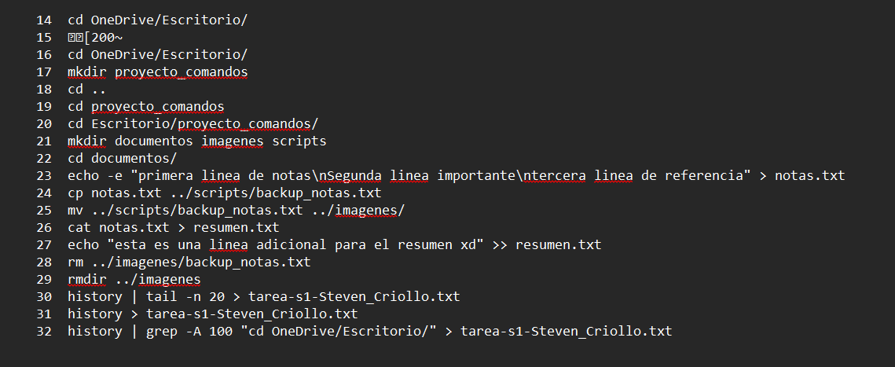

# Practica servidor web
## 1. Titulo

Creación y manipulación de estructuras de archivos y directorios en entornos CLI

## 2. Tiempo de duración

20 minutos 

## 3. Fundamentos:

La interfaz de línea de comandos (CLI) es una herramienta técnica fundamental en la administración avanzada de sistemas operativos basados en Unix y distribuciones de Linux. A diferencia de las interfaces gráficas de usuario (GUI), que dependen de la interacción visual la terminal establece un canal de comunicación directo y potente con el Kernel del sistema. Esta interacción se produce a través de un intérprete de comandos denominado Shell el cual traduce las instrucciones del usuario en procesos ejecutables por el núcleo del hardware permitiendo una gestión de recursos más granular y veloz.

Uno de los pilares conceptuales de Linux es su jerarquía de archivos. El sistema organiza toda su estructura de forma ramificada, naciendo desde un punto de origen común conocido como el directorio raíz (/). Comprender esta organización es vital, ya que en este entorno "todo es un archivo". El dominio de comandos de navegación como cd (Change Directory) y de creación como mkdir (Make Directory) otorga al administrador la capacidad de estructurar entornos de desarrollo de manera lógica y eficiente. Además, la distinción entre rutas absolutas (desde la raíz) y rutas relativas (desde la ubicación actual) es una habilidad técnica que minimiza errores al operar en servidores remotos o entornos de despliegue real.

Por otro lado, la manipulación de datos se vuelve una tarea sistemática mediante el uso de comandos como cp (copy) y mv (move). Mientras que el primero permite duplicar información para generar respaldos críticos, el segundo es una herramienta versátil que facilita tanto la reubicación física de los datos como el renombrado de archivos en una sola operación atómica. Esta eficiencia es inalcanzable mediante métodos visuales cuando se manejan grandes volúmenes de directorios. Asimismo, el uso del comando rmdir refuerza la seguridad del sistema, ya que exige que los directorios estén vacíos antes de su eliminación, actuando como una salvaguarda contra la pérdida accidental de datos estructurados.

La redirección de flujos representa el primer paso hacia la automatización de procesos. Los operadores de redirección permiten controlar el destino de la salida estándar de los comandos. Mientras que el operador > crea o sobrescribe archivos de forma inmediata, el operador de concatenación >> es indispensable en la administración de servidores para el mantenimiento de logs o registros históricos, permitiendo añadir información nueva al final de un documento sin comprometer los datos preexistentes.

Para cerrar este ciclo el comando history actúa como una bitácora técnica no solo permite al usuario auditar sus propias acciones sino que facilita la exportación de flujos de trabajo hacia archivos de texto para su posterior análisis o para la creación de scripts de automatización. En conjunto estas herramientas transforman la terminal en un entorno de trabajo robusto, profesional y altamente escalable para cualquier tecnólogo en desarrollo de software.

## 4. Conocimientos previos.
   
Para realizar esta práctica el estudiante necesito tener claro los siguientes temas:

- Estructura de directorios en Linux.

- Diferencia entre rutas absolutas y relativas.

- Uso básico de la terminal (GitBash).

## 5. Objetivos a alcanzar
   
- Crear una estructura de carpetas jerárquica mediante la terminal.

- Manipular archivos de texto mediante copia, movimiento y renombrado.

- Aplicar técnicas de redireccionamiento y concatenación de contenido.
  
## 6. Equipo necesario:
  
- Computador con sistema operativo Windows.

- Terminal GitBash o subsistema Linux (WSL) instalado.

## 7. Material de apoyo.
   
- Guía de la asignatura: Tarea autónoma semana 1.

- Cheat sheet de comandos básicos.

- Documentación oficial de GitBash
  
## 8. Procedimiento

Paso 1: Creación de directorios - Se creó la carpeta principal proyecto_comandos y dentro de ella las subcarpetas documentos, imagenes y scripts.

Paso 2: Generación de archivos - Dentro de documentos se creó notas.txt con tres líneas de texto usando echo.

Paso 3: Gestión de archivos - Se copió notas.txt a scripts con el nombre backup_notas.txt y luego se movió a la carpeta imagenes.

Paso 4: Redirección - Se creó resumen.txt replicando el contenido de notas.txt y se añadió una línea extra mediante el operador >>.

Paso 5: Limpieza - Se eliminó el archivo backup_notas.txt y la carpeta imagenes.

Paso 6: Entrega - Se exportó el historial de comandos al archivo tarea-s1-Steven_Criollo.txt.

Figura 1-1. Diagrama de contenedores.

  
  
<b>Figura 1-1. Diagrama de la estructura de directorios y flujo de la práctica.</b>

## 9. Resultados esperados:
    
Los resultados obtenidos al finalizar la práctica son los siguientes:

- Estructura Jerárquica: Se logró establecer un entorno de trabajo organizado donde cada tipo de archivo (documentos, scripts) esta en su ubicación correspondiente.

- Integridad de Datos: Mediante el uso de comandos de copia y movimiento, se validó que los archivos mantienen su contenido al ser desplazados por el sistema de archivos.

- Persistencia y Concatenación: El archivo resumen.txt refleja la aplicación de los operadores de redirección y concatenación permitiendo unificar información de distintas fuentes sin pérdida de datos previos.

- Trazabilidad: Se generó un registro completo de la actividad mediante el comando history, lo que permite la auditoría y replicación del proceso de forma precisa.

- Evidencia de Aprendizaje: Se consolidó el conocimiento técnico mediante la explicación verbal en el archivo de audio adjunto, cumpliendo con los estándares de comunicación solicitados para este ciclo en el Instituto Superior Tecnológico Sudamericano.

## 10. Bibliografía
    
- Garrels, M. (2004). Introducción a la línea de comandos de Linux y Unix. Proyecto de Documentación Linux. https://tldp.org/LDP/intro-linux/intro-linux.pdf

- Shotts, W. E. (2019). La línea de comandos de Linux: Introducción completa (2ª ed.). No Starch Press. https://linuxcommand.org/tlcl.php
(Capítulo 1: "Qué es la shell", interacción directa con kernel)

- Aprender21. (2026). Bash Linux: Qué es, comandos básicos y scripting [Guía 2026]. https://www.aprender21.com/blog/shell-linux

- Sánchez Corbalán. (s. f.). Los 50 mejores comandos Linux del shell Bash que debes conocer. https://sanchezcorbalan.es/mejores-comandos-linux-bash/
